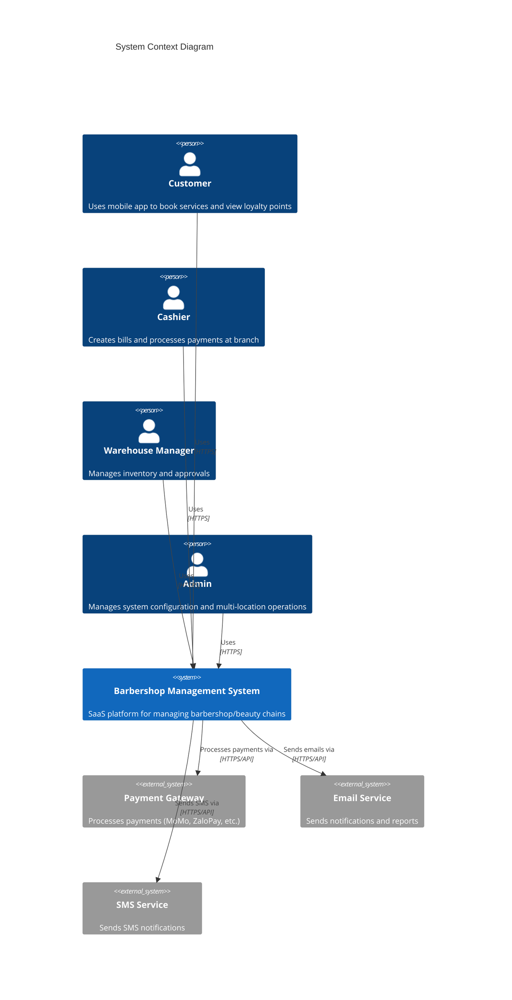
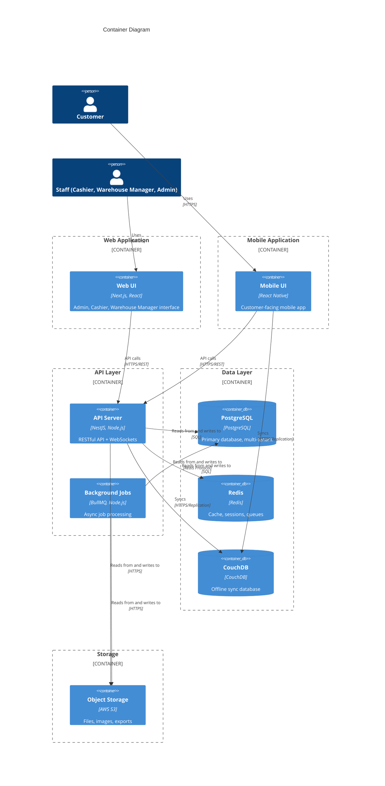

# System Design

**Last Updated:** 2025-12-09  
**Version:** 1.0

## Overview

This document outlines system design principles, patterns, and architectural decisions using the C4 model for the Barbershop/Beauty Chain Management System.

## Design Principles

### Core Principles

1. **Multi-Tenant First**
   - All features designed for multi-tenancy from day one
   - Tenant isolation at database and application level
   - Per-tenant resource limits and quotas

2. **Offline-First Architecture**
   - Web and mobile apps work offline
   - Conflict resolution for offline sync
   - Eventual consistency model

3. **Scalability by Design**
   - Horizontal scaling for all components
   - Stateless application servers
   - Database read replicas for read-heavy operations

4. **Security by Default**
   - Tenant isolation enforced at all layers
   - Input validation and sanitization
   - Least privilege access control

5. **Observability**
   - Comprehensive logging and monitoring
   - Distributed tracing
   - Business metrics tracking

### Architectural Patterns

1. **Layered Architecture**
   - Presentation Layer (Web/Mobile)
   - Application Layer (API/Business Logic)
   - Domain Layer (Business Rules)
   - Infrastructure Layer (Database, External Services)

2. **Event-Driven Architecture**
   - Domain events for cross-context communication
   - Event sourcing for audit trails
   - Async processing for background jobs

3. **CQRS (Command Query Responsibility Segregation)**
   - Separate read and write models
   - Optimized queries for reporting
   - Eventual consistency for reads

4. **Repository Pattern**
   - Abstraction over data access
   - Testability and maintainability
   - Database-agnostic business logic

## System Architecture

### C4 Model: Level 1 - System Context



### C4 Model: Level 2 - Container Diagram



### C4 Model: Level 3 - Component Diagram (API Server)

```mermaid
C4Component
    title API Server Component Diagram
    
    Container(apiServer, "API Server", "NestJS")
    
    Component_Boundary(auth, "Authentication Module") {
        Component(authController, "Auth Controller", "NestJS Controller")
        Component(authService, "Auth Service", "Business Logic")
        Component(jwtStrategy, "JWT Strategy", "Passport Strategy")
    }
    
    Component_Boundary(inventory, "Inventory Module") {
        Component(inventoryController, "Inventory Controller", "NestJS Controller")
        Component(inventoryService, "Inventory Service", "Business Logic")
        Component(inventoryRepository, "Inventory Repository", "Data Access")
    }
    
    Component_Boundary(billing, "Billing Module") {
        Component(billController, "Bill Controller", "NestJS Controller")
        Component(billService, "Bill Service", "Business Logic")
        Component(billRepository, "Bill Repository", "Data Access")
        Component(promotionService, "Promotion Service", "Business Logic")
    }
    
    Component_Boundary(sync, "Sync Module") {
        Component(syncController, "Sync Controller", "NestJS Controller")
        Component(syncService, "Sync Service", "Business Logic")
        Component(conflictResolver, "Conflict Resolver", "Business Logic")
    }
    
    ComponentDb(postgres, "PostgreSQL")
    ComponentDb(redis, "Redis")
    ComponentDb(couchdb, "CouchDB")
    
    Rel(authController, authService, "Uses")
    Rel(authService, jwtStrategy, "Uses")
    Rel(inventoryController, inventoryService, "Uses")
    Rel(inventoryService, inventoryRepository, "Uses")
    Rel(inventoryRepository, postgres, "Reads from and writes to")
    Rel(billController, billService, "Uses")
    Rel(billService, billRepository, "Uses")
    Rel(billService, promotionService, "Uses")
    Rel(billRepository, postgres, "Reads from and writes to")
    Rel(syncController, syncService, "Uses")
    Rel(syncService, conflictResolver, "Uses")
    Rel(syncService, couchdb, "Syncs")
```

## High-Level Architecture

### Architecture Layers

**1. Presentation Layer**
- Web UI (Next.js)
- Mobile UI (React Native)
- Responsive design
- Offline-first architecture

**2. Application Layer**
- RESTful API (NestJS)
- WebSocket server (Socket.io)
- Background job processors
- Authentication & Authorization

**3. Domain Layer**
- Domain entities
- Business logic
- Domain services
- Domain events

**4. Infrastructure Layer**
- Database access (TypeORM/Prisma)
- External service integrations
- File storage
- Message queues

## Component Architecture

### API Server Modules

**Core Modules:**
1. **Auth Module** - Authentication, authorization, JWT
2. **User Module** - User management, roles, permissions
3. **Tenant Module** - Multi-tenant management
4. **Branch Module** - Branch management
5. **Product Module** - Product catalog
6. **Inventory Module** - Inventory management
7. **Bill Module** - Bill creation and management
8. **Payment Module** - Payment processing
9. **Promotion Module** - Promotion engine
10. **Customer Module** - Customer management
11. **Sync Module** - Offline sync and conflict resolution
12. **Report Module** - Reporting and analytics

### Data Architecture

**Database Design:**
- **Multi-Tenancy:** Row-level security (RLS) with tenant_id
- **Normalization:** 3NF for transactional data
- **Denormalization:** Reporting tables for analytics
- **Indexing:** Strategic indexes for performance

**Caching Strategy:**
- **L1 Cache:** In-memory (Node.js) for frequently accessed data
- **L2 Cache:** Redis for shared cache across instances
- **Cache Invalidation:** Event-driven cache invalidation
- **TTL:** Configurable TTL based on data volatility

**Data Flow:**
```
Write → PostgreSQL → Event → Cache Invalidation → Redis Update
Read → Redis (if cached) → PostgreSQL (if not cached) → Cache Update
```

## Technology Stack

### Frontend
- **Framework:** Next.js 14+ (React)
- **UI:** Tailwind CSS + shadcn/ui
- **State:** Zustand + React Query
- **Offline:** PouchDB + IndexedDB

### Backend
- **Runtime:** Node.js 20+
- **Framework:** NestJS
- **API:** REST + WebSockets
- **Validation:** class-validator

### Database
- **Primary:** PostgreSQL 15+
- **Cache:** Redis 7+
- **Sync:** CouchDB 3+

### Infrastructure
- **Cloud:** AWS
- **Containers:** Docker + ECS Fargate
- **CI/CD:** GitHub Actions

## Design Decisions

### Decision 1: Multi-Tenancy Strategy

**Context:** Need to support multiple barbershop/beauty chains as separate tenants.

**Decision:** Database-level isolation using Row-Level Security (RLS) with tenant_id column.

**Rationale:**
- Simpler than separate databases per tenant
- Cost-effective (shared infrastructure)
- Easier to manage and scale
- PostgreSQL RLS provides strong isolation

**Consequences:**
- **Positive:** Lower cost, easier management, shared resources
- **Negative:** Requires careful query design, potential for data leakage if not properly implemented
- **Mitigation:** Automated testing for tenant isolation, middleware enforcement

### Decision 2: Offline-First Architecture

**Context:** Network reliability issues in Vietnam, need for offline bill creation.

**Decision:** Offline-first architecture with CouchDB for sync and conflict resolution.

**Rationale:**
- Critical for Vietnamese market (network issues)
- CouchDB provides built-in replication and conflict resolution
- Proven technology for offline-first apps

**Consequences:**
- **Positive:** Works offline, better user experience, handles network issues
- **Negative:** More complex architecture, conflict resolution needed
- **Mitigation:** Clear conflict resolution rules, user-friendly conflict UI

### Decision 3: Event-Driven Architecture

**Context:** Need for real-time updates, audit trails, and async processing.

**Decision:** Domain events for cross-context communication, event sourcing for audit.

**Rationale:**
- Decouples components
- Enables real-time updates via WebSockets
- Provides audit trail
- Supports async processing

**Consequences:**
- **Positive:** Loose coupling, scalability, auditability
- **Negative:** Eventual consistency, more complex debugging
- **Mitigation:** Event versioning, comprehensive logging

## Related Documents

- **[Infrastructure](../infrastructure.md)** - Infrastructure design
- **[Domain Specs](../architecture/domain-specs.md)** - Domain model
- **[API Contracts](../architecture/api-contracts/)** - API specifications
- **[Coding Standards](coding-standards.md)** - Implementation standards
- **[Decision Log](../../../8-governance/decision-log.md)** - Architecture Decision Records

---

*Document major design decisions here to maintain architectural consistency.*
