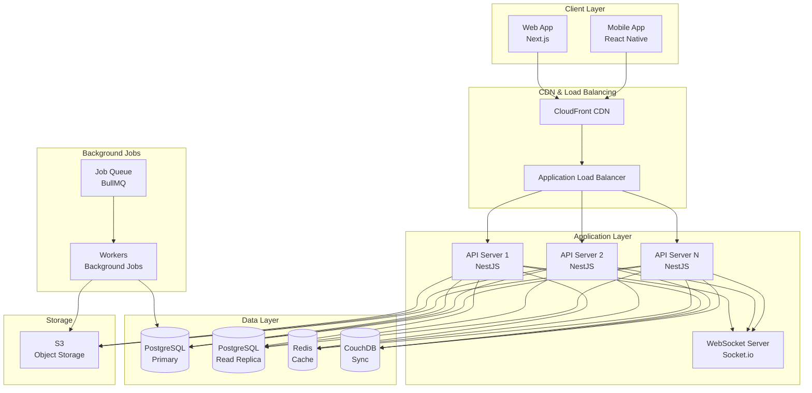

# Infrastructure

**Last Updated:** 2025-12-09  
**Version:** 1.0

## Overview

This document describes the infrastructure setup for the Barbershop/Beauty Chain Management System (SaaS), including technology stack selection, cloud providers, scaling strategy, and cost estimates.

## Technology Stack

### Tech Stack Selection Rationale

**Key Requirements:**
- Multi-tenant SaaS architecture
- Offline capability for web and mobile
- Real-time synchronization
- Vietnamese market support
- Scalable from 10 to 10,000+ locations
- Cost-effective for startup phase

**Selected Stack:**

### Frontend

**Web Application (Admin/Cashier/Warehouse Manager):**
- **Framework:** Next.js 14+ (React)
  - **Rationale:** Server-side rendering for performance, excellent SEO, built-in API routes, TypeScript support
  - **Offline Support:** Service Workers + IndexedDB for offline-first architecture
- **UI Framework:** Tailwind CSS + shadcn/ui
  - **Rationale:** Rapid development, consistent design system, accessible components
- **State Management:** Zustand + React Query
  - **Rationale:** Lightweight, simple API, excellent for server state management
- **Forms:** React Hook Form + Zod
  - **Rationale:** Performance, validation, TypeScript integration
- **Offline Sync:** PouchDB + CouchDB sync
  - **Rationale:** Proven offline-first solution, conflict resolution, real-time sync

**Mobile Application (Customer-Facing):**
- **Framework:** React Native (Expo)
  - **Rationale:** Cross-platform (iOS + Android), single codebase, native performance
  - **Offline Support:** AsyncStorage + SQLite (react-native-sqlite-storage)
- **Navigation:** React Navigation
- **State Management:** Zustand + React Query
- **Forms:** React Hook Form + Zod

### Backend

**API Server:**
- **Runtime:** Node.js 20+ (LTS)
- **Framework:** NestJS
  - **Rationale:** Enterprise-grade, TypeScript-first, modular architecture, excellent for multi-tenant SaaS
  - **Features:** Built-in dependency injection, decorators, guards, interceptors
- **API Style:** RESTful API + WebSockets (for real-time)
  - **Documentation:** OpenAPI/Swagger
- **Validation:** class-validator + class-transformer
- **Authentication:** JWT + Refresh Tokens
- **Authorization:** Role-based access control (RBAC) with NestJS guards

**Background Jobs:**
- **Queue System:** BullMQ + Redis
  - **Rationale:** Reliable job processing, retry logic, job prioritization
- **Use Cases:** Email sending, report generation, data sync, scheduled tasks

**Real-Time Communication:**
- **WebSockets:** Socket.io
  - **Rationale:** Real-time updates, fallback to polling, room-based messaging
- **Use Cases:** Inventory updates, bill status, approval notifications

### Database

**Primary Database:**
- **PostgreSQL 15+**
  - **Rationale:** ACID compliance, excellent for multi-tenant SaaS, JSON support, full-text search
  - **Multi-Tenancy:** Row-level security (RLS) for tenant isolation
  - **Hosting:** Managed PostgreSQL (AWS RDS, Google Cloud SQL, or Supabase)

**Caching:**
- **Redis 7+**
  - **Rationale:** Fast in-memory cache, session storage, rate limiting, pub/sub
  - **Use Cases:** Session management, API rate limiting, real-time data cache
  - **Hosting:** Managed Redis (AWS ElastiCache, Google Cloud Memorystore, or Upstash)

**Offline Sync Database:**
- **CouchDB 3+**
  - **Rationale:** Built-in replication, conflict resolution, document-based (JSON)
  - **Use Cases:** Offline-first architecture, sync between web/mobile and server
  - **Hosting:** Managed CouchDB (Cloudant, or self-hosted)

**Search:**
- **PostgreSQL Full-Text Search** (initial)
  - **Future:** Elasticsearch or Algolia (if needed for advanced search)

### File Storage

**Object Storage:**
- **AWS S3** or **Google Cloud Storage**
  - **Rationale:** Scalable, cost-effective, CDN integration
  - **Use Cases:** Product images, service images, documents, exports
- **CDN:** CloudFront (AWS) or Cloud CDN (GCP)
  - **Rationale:** Fast global delivery, reduced latency

### Infrastructure & DevOps

**Cloud Provider:**
- **Primary:** AWS (Amazon Web Services)
  - **Rationale:** Comprehensive services, Vietnamese market support, cost-effective scaling
  - **Alternative:** Google Cloud Platform (GCP) - considered for better pricing in some regions

**Container Orchestration:**
- **Docker** + **Docker Compose** (development)
- **AWS ECS (Fargate)** or **Kubernetes (EKS)** (production)
  - **Rationale:** Containerized deployment, easy scaling, service isolation

**CI/CD:**
- **GitHub Actions** or **GitLab CI/CD**
  - **Rationale:** Integrated with code repository, automated testing and deployment

**Monitoring & Observability:**
- **Application Monitoring:** Sentry (error tracking)
- **APM:** New Relic or Datadog (application performance monitoring)
- **Logging:** AWS CloudWatch Logs or Google Cloud Logging
- **Metrics:** Prometheus + Grafana (self-hosted or managed)

**Infrastructure as Code:**
- **Terraform** or **AWS CDK**
  - **Rationale:** Reproducible infrastructure, version control, environment parity

## Cloud Provider & Regions

### Primary Cloud Provider: AWS

**Regions:**
- **Primary:** ap-southeast-1 (Singapore) - Low latency to Vietnam, good service availability
- **Secondary:** ap-southeast-2 (Sydney) - Backup region
- **Future:** ap-northeast-1 (Tokyo) - If expanding to other Asian markets

**Services Used:**
- **Compute:** ECS Fargate (serverless containers)
- **Database:** RDS PostgreSQL (managed)
- **Cache:** ElastiCache Redis (managed)
- **Storage:** S3 (object storage)
- **CDN:** CloudFront
- **Load Balancer:** Application Load Balancer (ALB)
- **DNS:** Route 53
- **Monitoring:** CloudWatch
- **Secrets:** AWS Secrets Manager

### Alternative: Google Cloud Platform

**Consideration:** GCP may offer better pricing for some services in Southeast Asia
- **Compute:** Cloud Run (serverless containers)
- **Database:** Cloud SQL PostgreSQL
- **Cache:** Cloud Memorystore Redis
- **Storage:** Cloud Storage
- **CDN:** Cloud CDN

## Scaling Strategy

### Horizontal Scaling

**Application Tier:**
- **Stateless Design:** All application servers are stateless
- **Auto-Scaling:** ECS Fargate auto-scaling based on CPU/memory metrics
- **Load Balancing:** ALB distributes traffic across multiple instances
- **Target:** Scale from 1 to 100+ instances based on load

**Database Tier:**
- **Read Replicas:** PostgreSQL read replicas for read-heavy operations
- **Connection Pooling:** PgBouncer for connection management
- **Future:** Consider database sharding if needed (10,000+ locations)

**Cache Tier:**
- **Redis Cluster:** Redis cluster mode for high availability
- **Cache Warming:** Pre-warm frequently accessed data

### Vertical Scaling

**Initial Phase (0-100 locations):**
- **Application:** 2 vCPU, 4GB RAM per instance (2-4 instances)
- **Database:** db.t3.medium (2 vCPU, 4GB RAM)
- **Cache:** cache.t3.micro (0.5GB)

**Growth Phase (100-1,000 locations):**
- **Application:** 4 vCPU, 8GB RAM per instance (4-8 instances)
- **Database:** db.t3.large (2 vCPU, 8GB RAM) + 1 read replica
- **Cache:** cache.t3.small (1.37GB)

**Scale Phase (1,000-10,000 locations):**
- **Application:** 8 vCPU, 16GB RAM per instance (8-16 instances)
- **Database:** db.r5.xlarge (4 vCPU, 32GB RAM) + 2-3 read replicas
- **Cache:** cache.r5.large (13.07GB)

### Multi-Tenancy Strategy

**Database-Level Isolation:**
- **Row-Level Security (RLS):** PostgreSQL RLS for tenant isolation
- **Tenant ID:** Every table includes `tenant_id` column
- **RLS Policies:** Automatic filtering by tenant_id

**Application-Level Isolation:**
- **Tenant Context:** Middleware extracts tenant from subdomain or JWT
- **Data Access:** All queries automatically filtered by tenant
- **Resource Limits:** Per-tenant rate limiting and quotas

## Cost Estimates

### Monthly Costs by Scale

**Phase 1: MVP/Beta (10-50 locations)**
- **Compute (ECS Fargate):** $50-100/month (2-4 small instances)
- **Database (RDS PostgreSQL):** $50-100/month (db.t3.medium)
- **Cache (ElastiCache Redis):** $15-30/month (cache.t3.micro)
- **Storage (S3):** $10-20/month (10-50GB)
- **CDN (CloudFront):** $10-30/month
- **Other (ALB, Route 53, CloudWatch):** $20-40/month
- **Total:** ~$165-320/month (~4-8M VND/month)

**Phase 2: Growth (50-500 locations)**
- **Compute:** $200-500/month (4-8 medium instances)
- **Database:** $200-400/month (db.t3.large + 1 replica)
- **Cache:** $50-100/month (cache.t3.small)
- **Storage:** $50-100/month (100-500GB)
- **CDN:** $50-150/month
- **Other:** $50-100/month
- **Total:** ~$600-1,350/month (~15-34M VND/month)

**Phase 3: Scale (500-5,000 locations)**
- **Compute:** $1,000-3,000/month (8-16 large instances)
- **Database:** $500-1,500/month (db.r5.xlarge + 2-3 replicas)
- **Cache:** $200-500/month (cache.r5.large)
- **Storage:** $200-500/month (500GB-2TB)
- **CDN:** $200-500/month
- **Other:** $200-400/month
- **Total:** ~$2,300-6,400/month (~58-160M VND/month)

**Cost Optimization:**
- Reserved Instances: 30-40% savings for predictable workloads
- Spot Instances: 50-70% savings for non-critical workloads
- Auto-scaling: Scale down during low-traffic hours
- CDN caching: Reduce origin server load

## Security

### Security Measures

**Network Security:**
- **VPC:** Isolated virtual private cloud
- **Security Groups:** Restrictive firewall rules
- **WAF:** AWS WAF for DDoS protection and common attacks
- **SSL/TLS:** All traffic encrypted (HTTPS, WSS)

**Application Security:**
- **Authentication:** JWT with secure token storage
- **Authorization:** RBAC with tenant isolation
- **Input Validation:** All inputs validated and sanitized
- **SQL Injection Prevention:** Parameterized queries, ORM
- **XSS Prevention:** Content Security Policy (CSP), input sanitization
- **CSRF Protection:** CSRF tokens, SameSite cookies

**Data Security:**
- **Encryption at Rest:** Database encryption, S3 encryption
- **Encryption in Transit:** TLS 1.3 for all connections
- **Secrets Management:** AWS Secrets Manager for API keys, passwords
- **Backup Encryption:** Encrypted backups

**Compliance:**
- **GDPR:** Data protection measures (if applicable)
- **Vietnamese Data Protection:** Local data residency requirements
- **Audit Logging:** All actions logged for compliance

## Disaster Recovery & Backup

### Backup Strategy

**Database Backups:**
- **Automated Daily Backups:** RDS automated backups (7-day retention)
- **Weekly Snapshots:** Manual snapshots for long-term retention
- **Point-in-Time Recovery:** 7-day PITR capability
- **Backup Storage:** Encrypted backups in separate region

**Application Backups:**
- **Infrastructure as Code:** Terraform/CDK for infrastructure recovery
- **Container Images:** Stored in ECR (Elastic Container Registry)
- **Configuration:** Version-controlled in Git

**File Storage Backups:**
- **S3 Versioning:** Enabled for critical files
- **Cross-Region Replication:** Critical files replicated to backup region
- **Lifecycle Policies:** Automatic archival to cheaper storage

### Disaster Recovery Plan

**RTO (Recovery Time Objective):** 4 hours
**RPO (Recovery Point Objective):** 1 hour

**Recovery Procedures:**
1. **Database:** Restore from latest backup in backup region
2. **Application:** Deploy from container registry to backup region
3. **DNS:** Failover to backup region via Route 53
4. **Verification:** Automated health checks and smoke tests

## Monitoring & Observability

### Application Monitoring

**Error Tracking:**
- **Sentry:** Real-time error tracking, alerting, performance monitoring
- **Integration:** Frontend and backend error tracking

**Application Performance Monitoring (APM):**
- **New Relic** or **Datadog:** Application performance, database queries, API response times
- **Metrics:** Response times, throughput, error rates

**Logging:**
- **CloudWatch Logs:** Centralized logging for all services
- **Log Aggregation:** Structured logging (JSON format)
- **Log Retention:** 30 days (standard), 90 days (critical logs)

**Metrics:**
- **CloudWatch Metrics:** Custom metrics for business KPIs
- **Prometheus + Grafana:** Advanced metrics and dashboards
- **Key Metrics:** Request rate, error rate, latency, database connections, cache hit rate

### Alerting

**Critical Alerts:**
- Application errors (error rate > 1%)
- Database connection failures
- High latency (> 2s p95)
- Disk space (< 20% free)
- Memory usage (> 80%)

**Notification Channels:**
- Email
- Slack
- PagerDuty (for critical alerts)

## Infrastructure Diagram

## Related Documents

- **[System Design](design-standards/system-design.md)** - Detailed system architecture
- **[Domain Specs](architecture/domain-specs.md)** - Domain model and business logic
- **[API Contracts](architecture/api-contracts/)** - API specifications
- **[DevOps](../../3.3-devops/README.md)** - Deployment and configuration
- **[Server Steps](../../3.3-devops/server-steps.md)** - Server setup procedures
- **[Decision Log](../../../8-governance/decision-log.md)** - ADR-002: Tech Stack Selection

---

*Keep this document updated as infrastructure evolves and scales.*
